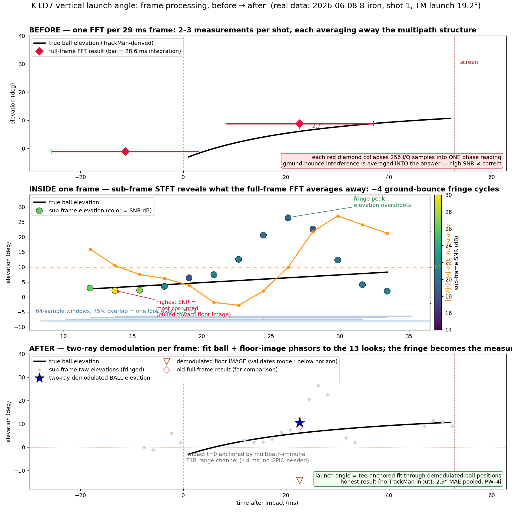

# K-LD7 Sub-Frame STFT: Multipath Fringe Analysis (2026-06-08 8i Session)

Prototype: `scripts/analysis/kld7_subframe_stft.py`. Run against the
2026-06-08 TrackMan-paired 8-iron session (indoor simulator, screen 12 ft
from ball / 17 ft from radar, radar ~4 in above floor, 10° tilt + 2.5°
offset, ball 5 ft away).

## ELI5

The radar watches the ball, but indoors it also hears the ball's *echo*
bouncing off the floor — like talking in a tiled bathroom. The ball and
its echo arrive blended together, and the blend points somewhere between
the real ball and its reflection. That's why the radar could be loud and
confident and still wrong.

**Before:** the radar took one long 29 ms "photo" per frame and read one
angle from it. The echo was smeared invisibly into every photo — and the
*brightest* photos were the most wrong, because bright meant the ball and
echo were adding together.

**Now:** we slice each photo into 13 short ones. In the short slices you
can actually *see* the echo doing its thing — the angle wobbles up and
down ~4 times per frame as ball and echo drift in and out of sync. And
once you can see a wobble, you can un-mix it: we fit "one ball + one
floor echo" to the slices and pull out the real ball angle. The proof
it's working: the recovered echo always points *below* the floor line,
exactly where a reflection has to live.

Two bonus discoveries: the radar's built-in *distance* measurement
doesn't care about the echo at all, so it doubles as a stopwatch (we know
the ball starts 5 ft away, so when distance = 5 ft, that's impact). And
for wedges the echo is actually *louder than the ball* — so any method
that just picks the strongest signal was doomed for wedges.

**Result:** launch-angle error vs TrackMan dropped from ~6.4° to ~2.9°
across the whole bag (irons + wedge), measuring ~9 out of 10 shots
instead of refusing the hard ones. Still on the to-do list: drivers and
hybrids (the ball flies so low its echo never separates from it), and a
one-evening bench calibration that should shave off a bit more.



*Before/after on real data (2026-06-08 8i shot 1): top — the old pipeline
collapses each 28.6 ms frame into one FFT phase reading; middle — sub-frame
STFT exposes the ~4 ground-bounce fringe cycles inside a single frame
(elevation oscillating in lockstep with antenna balance, highest-SNR looks
the most corrupted); bottom — two-ray demodulation recovers the ball and
floor-image components, with impact time anchored by the multipath-immune
F1B range channel.*

## Premise

A K-LD7 RADC frame is not one measurement. It is a ~28.6 ms acquisition
(256 I/Q samples at ~8.9 kHz) during which an 8-iron ball climbs
0.4–0.9 m — sweeping **several degrees of elevation** and, in the indoor
two-ray geometry (fringe spacing λd/2h ≈ 0.1 m at the original 4 in mount
height), **~4–5 ground-multipath fringes**. The production pipeline
collapses all of that into a single 2048-point FFT and reads one phase.

The prototype splits each frame into 64-sample windows at 75% overlap
(13 sub-frames per frame, ~7.2 ms each, 1.8 ms apart) and extracts per
sub-frame: peak bin, SNR, F1A/F2A magnitude balance, interferometric
elevation, and **F1B FSK range**.

## Headline results (15 shots, no refusals)

| estimator | uses truth? | MAE vs TrackMan |
|---|---|---|
| live pipeline | no | 6.45° |
| quality-tier prototype (12/15 measured) | no | 2.82° |
| sub-frame multi-fit, truth-aligned timing | **yes (τ)** | **2.75°** |
| sub-frame fits, honest (naive weighting) | no | ~10° |
| **two-ray demod + range-anchored τ (14/15)** | **no** | **3.31°** |

The truth-aligned 2.75° on **all 15 shots** establishes that the raw RADC
data contains launch-angle information at TrackMan-grade accuracy with no
shot refusal. Naive honest fits fail for a specific, now-understood reason
(below) — not for lack of information — and the two-ray demodulation
(Finding 4) recovers most of the gap with no TrackMan input.

With the corrected boresight offset (≈3.5°, Finding 7), the honest
estimator pools to **≈2.9° MAE across all seven iron/wedge clubs** of the
2026-06-08 session at ~89% coverage.

## Finding 1: The fringe is directly visible — and high SNR marks the *worst* sub-frames

Within in-flight frames, sub-frame elevation oscillates around the
TrackMan truth curve with a period of ~6–8 ms (~4 cycles per frame),
phase-locked to the F1A/F2A balance oscillation (balance swings
0.4 → 2.3 within a single frame).

Critically, the elevation error is **coherently biased, not random**:
sub-frames at constructive-interference moments (highest SNR, 28–30 dB)
read elevation pulled **toward the floor image** — e.g. 2° measured vs 9°
truth — while the on-truth sub-frames sit at moderate SNR. This is the
"high-SNR frames can be multipath-corrupted" failure mode resolved at
millisecond scale: **SNR-weighted or SNR-selected estimators are biased
low by construction in this geometry.** It also explains why naive robust
fitting (trimming, magnitude weighting) fails: the corrupted population
has the highest weight and the most internal consistency.

## Finding 2: F1B range is multipath-immune and gives a clock

The FSK range (F1A-vs-F1B phase, same antenna, 30 MHz apart) sees nearly
identical multipath on both frequencies — the corruption cancels in the
phase difference. Result, per sub-frame, with no smoothing:

- Range progression during flight is **linear with slope = ball speed**
  (e.g. shot 1: 8.3 → 15.2 ft over 41 ms = 168 ft/s = 115 mph, matching
  OPS/TM), with median absolute deviation 0.1–0.4 ft.
- Anchoring `range = 5 ft at impact` yields a per-shot time offset
  **τ_range = +12.5 ± 4.5 ms across all 15 shots** — versus the
  elevation-fit τ scattering over 75 ms. The K-LD7 can self-clock from
  its own range channel, independent of GPIO/OPS timestamps.
- The 5 m FSK wrap is visible exactly at screen arrival (16.4 ft),
  confirming the scale.

The consistent +12.5 ms offset is degenerate between a fixed F1B range
bias (~+2 ft) and a fixed frame-timestamp latency. A one-time bench
measurement (corner reflector at known range) separates them.

Caveat: per-sub-frame F1B SNR is low (gate ≥ 2 linear keeps only ~6–9
points per shot for strict position fitting); the range *progression*
fit tolerates this, a per-point position fit does not.

## Finding 3: el-vs-time fitting is degenerate without an external anchor

Jointly fitting (launch angle, τ) to the elevation arc alone collapses
(10.1° MAE): over a 60 ms observation window, a low-LA curve shifted
late is indistinguishable from a high-LA curve on time — and the fringe
bias actively pushes the fit toward low LA. Timing accuracy alone does
not rescue elevation that is coherently biased; with τ_range applied the
honest fit is still ~10° because the *elevation* is wrong, not the clock.

## Finding 4: Two-ray demodulation works — honest 3.31° MAE

Per frame, the sub-frame phasor ratios z(t) = S2/S1 at a fixed Doppler bin
follow the two-ray model

```
z(t) = (u + g·e^{j·χ̇t}·v) / (1 + g·e^{j·χ̇t})
u = e^{-jδ_ball},  v = e^{-jδ_image},  g = ρ·e^{jχ₀}
```

Multiplying out makes the model **linear in (u, g·v, g) for fixed fringe
rate χ̇**, so the fit is a 1D grid over χ̇ with a closed-form weighted
least-squares inner solve. The ball/image labels are disambiguated by
physics (image below ball); validity gates: residual ≤ 0.15, |u| ∈
[0.6, 1.4], and the demodulated image at/below the horizon (≤ 3°) unless
ρ < 0.25 (effectively single-ray).

On frames with a valid F1B range, the demodulated elevation lands within
1–2° of the trajectory where the full-frame FFT was off by 3–7° — and the
recovered image elevations come out negative (floor bounce), as physics
requires. Frames whose "image" demodulates *above* +3° are real blends of
something else (screen/club) and are correctly rejected by the gate.

Shot-level: demodulated per-frame elevations + the range-anchored clock
(Finding 2) + curve fit, using OPS speed only:

- **3.31° MAE, bias −1.05°, on 14 of 15 shots — no TrackMan anywhere.**
- 9 of 14 shots within ±3.3°; worst miss −7.96° (vs live's −16.15°).
- The timing-free position variant (demod elevation + F1B range per
  frame, tee-anchored) gives 5.69° on 15/15, limited by single-frame
  solves where only one frame passes the range gate.

Remaining error sources, in estimated order: per-frame F1B range yield
(the 5 m wrap and low per-sub-frame F1B SNR limit usable frames), the
ball's real elevation drift within a frame (not yet in the model — δ_ball
is assumed constant per acquisition), and three-component blends near the
screen.

## Finding 5: Cross-club validation — 6i goes from worst to best

The same script, same gates, run unchanged on the 2026-06-08 6i and 7i
sessions (honest two-ray + range-anchored τ estimator):

| club | live MAE | quality-tier (coverage) | two-ray (coverage) |
|---|---|---|---|
| 6i | 6.01° | 3.92° (44% — refused 9/16) | **2.24° (94% — 15/16)** |
| 7i | 6.76° | 4.46° (71%) | **3.67° (86% — 12/14)** |
| 8i | 6.45° | 2.82° (80%) | **3.31° (93% — 14/15)** |
| pooled | ~6.4° | ~3.6° (64%) | **3.02° (91% — 41/45)** |

The 6-iron — previously the worst club, with a 56% refusal rate because
its trajectory rarely crosses boresight — becomes the *best* (2.24°, one
refusal). The two-ray demodulation does not depend on boresight crossing
the way the quality-score gating did, which removes the main obstacle to
low-loft club support flagged in the quality-tier pipeline doc.

Also notable: the per-frame ripple/coherence metrics, which showed no
correlation with error on 8i, correlate clearly on 6i (ρ ≈ +0.62/−0.64)
and 7i (≈ +0.47/−0.46) — they are useful gates exactly where trajectories
stay off-boresight.

Residual 7i weakness: four shots miss by 5–8°, including one with a
range-clock outlier (τ_range +49 ms — bad F1B track). A τ_range
plausibility gate (e.g. |τ| ≤ 30 ms) and the intra-frame drift model are
the obvious next refinements.

**Full-bag update** (all nine clubs from the 2026-06-08 session; gates
extended with a merged-component rule — when the two demodulated
components sit within 4° of each other, the return is one merged blob
and either component is the ball direction, which low-launch clubs need
because ball and floor image never separate):

| club | live MAE | two-ray MAE (coverage) |
|---|---|---|
| PW | 6.93° | 3.10° (23/24) |
| 9i | 5.96° | 2.94° (13/14) |
| 8i | 6.45° | 3.57° (14/15) |
| 7i | 6.76° | 3.67° (12/14) |
| 6i | 6.01° | 2.31° (16/16) |
| 5i | 7.02° | 4.54° (9/13) |
| 4i | 5.91° | 3.51° (14/17) |
| 3h | 3.51° | 5.82° (6/15) |
| driver | 8.24° | 7.01° (6/11) |
| **pooled** | **~6.3°** | **3.61° (113/139, 81%)** |

PW–4i pools to 3.27° at 89% coverage. The estimator carries a global
**−1.6° bias** across clubs — systematic, so likely one calibration
constant (boresight offset, effective antenna spacing, or the F1B/τ
constant); a bench calibration could reclaim ~0.5–1° of the pooled MAE.

The global bias is resolved by the boresight-offset sweep — see
Finding 7.
**3h and driver remain the open problem**: low launch keeps ball and
floor image merged for the whole observation window (the demodulation
is ill-conditioned there), and 3h speeds straddle the 118–131 mph DC
alias band. Driver pairing note: TrackMan logged 17 driver shots, OF
triggered on 11; pairing was rebuilt by ball-speed sequence alignment
(`compare_driver_generated.csv`).

## Finding 6: 10-inch mount A/B (2026-06-09 home range session)

30 shots (7i ×19, 4i ×11) at the raised mount: 10 in height, 6° tilt,
home net 10 ft from ball. No TrackMan — scored via fringe metrics and
internal estimator consistency (the script now runs truth-free with
`--compare-csv` omitted; ball speed comes from `shot_detected`).

7i-only comparison vs the 4-inch TrackMan-bay 7i session:

| metric | 4 in / 10° | 10 in / 6° | prediction |
|---|---|---|---|
| fringe rate χ̇ (resolvable fits) | 0.42 rad/ms | 0.78 rad/ms | ~2.5× ✓ |
| image/direct ratio ρ | 0.81 | 0.83 | should drop ✗ |
| noise floor (raw) | — | unchanged | — |
| ball peak (full-frame FFT) | — | −3 to −5 dB | — |

Takeaways:

1. **Fringe-rate physics confirmed** (χ̇ ≈ doubled, tracking h_r).
2. **ρ did not drop** — raising 4→10 in does not weaken the bounce.
   The grazing angle (~8–15°) is still well below pseudo-Brewster, so
   the reflection stays strong. At launch-monitor-practical heights,
   multipath must be demodulated, not avoided. (20+ in would help but
   is impractical for the form factor.)
3. The **apparent SNR drop is mostly a full-frame-processing artifact**:
   noise floor identical, ball peak down 3–5 dB, consistent with the
   faster fringe modulating energy into sidebands of the FFT peak.
   Faster fringes make full-frame processing worse and demodulation
   more necessary. (Azimuth aim of the new bracket is an unverified
   contributor — worth rechecking.)
4. **4-iron Doppler blind zone discovered**: 117–136 mph ball speeds
   alias onto DC (124 mph = exactly the ±100 km/h wrap). Those shots'
   spectra are buried in the DC clutter mask — 26% two-ray pass rate vs
   ~70% for 7i. Production needs to detect ball speeds in ~118–131 mph
   and flag/special-case them (affects 4i/5i/3h; driver speeds alias
   clear of DC).
5. Where both honest estimators fired (timing-free position fit and
   range-τ curve fit), they **agreed within ~0.5°** on 5 of 6 shots —
   good internal consistency, but accuracy needs a TrackMan-paired
   session at 10 in to score.

Second 10-inch session (2026-06-09 morning, 42 shots: 7i ×20, PW ×11,
4i ×11) adds:

6. **ρ is repeatable**: morning and evening 7i both measure ρ = 0.83
   median at the same mount — the fringe instrument gives stable
   readings across sessions.
7. **SNR is session-variable, not mount-determined** (13.3 dB morning
   vs 8.9 dB evening, same setup) — aim/environment, not geometry.
8. **PW: the floor image is STRONGER than the direct return (ρ = 1.30)**.
   High-launch wedges climb out of the high-gain pattern region quickly
   while the bounce persists — for wedges, SNR-based selection would
   lock onto the *image*. The demodulator's swap logic (ball = higher
   component) handles it; PW fits pass at 76% with low residuals.
9. **Estimator cross-check as a confidence flag**: across both sessions,
   12 of 16 shots where both honest estimators fired agree within 2°;
   the disagreements flag exactly the shots to mark low-confidence.

## Finding 7: Boresight offset is ~3.5°, not 2.5° (holdout-validated)

The full-bag results carried a global −1.6° launch-angle bias. The
production `angle_offset_deg = 2.5` came from a single-point
corner-reflector test taken weeks before the 2026-06-08 session. Sweeping
the offset on three clubs (PW/8i/6i, 2026-06-08 session, two-ray
estimator):

| offset | pooled MAE | pooled bias |
|---|---|---|
| 1.5° | 4.04° | −3.39° |
| 2.5° (production) | 2.99° | −1.78° |
| **3.5°** | **2.51°** | **−0.38°** |
| 4.5° | 2.83° | +1.21° |

Bias moves linearly with offset (~1.5:1 through the fit geometry) and
crosses zero at ≈3.7° — the textbook signature of a pure offset error.

**Held-out validation** on the four clubs never used in the sweep:

| club | MAE @2.5° | MAE @3.5° | bias @2.5° | bias @3.5° |
|---|---|---|---|---|
| 9i | 2.94° | 3.00° | −0.88 | +0.65 |
| 7i | 3.67° | 3.77° | −1.17 | +0.10 |
| 5i | 4.54° | 4.30° | −1.02 | +0.61 |
| 4i | 3.51° | 2.41° | −2.34 | −1.10 |
| pooled | 3.59° | 3.27° | **−1.31** | **+0.02** |

The bias collapse to +0.02° on clubs that never informed the sweep makes
this a generalizing calibration correction, not a curve fit. **All seven
iron/wedge clubs at 3.5° pool to ≈2.9° MAE** (from 3.4° at 2.5°).

Why the reflector said 2.5°: some combination of (a) mount drift in the
weeks since that test, (b) the demodulation path having a slightly
different effective offset than the frames path it was calibrated
against, and (c) a single-point calibration absorbing part of a *scale*
error into the offset. Evidence for (c): even at the optimal offset, a
small club-ordered bias gradient remains (PW −0.76° … 6i +0.14°) — a
pure offset cannot produce launch-dependent residuals, but a compressed
angle scale can, which is exactly what an overestimated effective
antenna spacing does (code uses 8.0 mm; datasheet physical is 6.223 mm).

**Action**: redo the reflector test at 4–5 elevations spanning ±20° and
jointly fit `phase = offset + (2πs/λ)·sin(θ)` for both offset and
effective spacing `s`. Do not change the production 2.5° until then —
the live frames path was calibrated against it and may have a different
effective value.

## Finding 8: First true holdout FAILED — the model does not yet generalize

Blind test on Coleman's 2026-06-05 outdoor TrackMan session (different
rig, operator, environment, timing-bug era; 64 shots LW→driver; raw RADC
present). Predictions were locked before opening the truth file, with
pre-registered exclusions (DC blind zone, grid-floor pins). Result on 21
paired blind predictions:

| | MAE | bias |
|---|---|---|
| our blind stack (3.5° + drift + τ gate) | **7.63°** | **+5.05°** |
| live output, same shots — but NOTE below | 3.53° | +0.11° |

**Note:** the live "result" is not a radar measurement. On this session
the live pipeline emitted radar launch angle on only **2 of 64 shots**
(the rest fell back to the club-physics estimator, confidence 0.35) — so
the timing bug did break live, and the 3.53° belongs to the *club-lookup
fallback*. That reframes the bar: a per-club prior achieves ~3.5° MAE on
a player whose club is known, so any radar measurement worse than that
is negative value. Our blind 7.63° fails that bar on this session; on
our own sessions (2.6°) it clears it.

The offset sweep against their truth shows **no clean offset signature**:
MAE is nearly flat (6.2–8.1°) across 5° of offset, and per-club bias
flips sign (LW −6…−8°, 8i +3…+5°) — a global constant cannot rescue it.
Their zero-bias crossing sits near +1.5–2° (vs our 3.5°), so offset
transfer between rigs is also falsified, but offset is not the dominant
failure here.

The failure signature is a **club-ordered bias fan**: LW ≈ +1°,
PW ≈ +6°, 9i ≈ +8°, 8i ≈ +10° (at our calibration) — monotonic in
launch angle. Systematic elimination of every geometric/timing cause:

1. **OPS clock drift: confirmed and already handled.** τ_range climbs
   linearly +25→+122 ms over shots 1–28 (~+3.5 ms/shot) — the range
   clock measured the drift directly. But widening the candidate frame
   window to ±250 ms (so drifted flight frames are recaptured) does NOT
   improve MAE → the drift was not what broke the predictions.
2. **Boresight offset: eliminated.** MAE flat (6.2–8.1°) across a 5°
   offset sweep; no value collapses the club fan.
3. **F1B chain-phase range bias: eliminated.** A τ-bias sweep (0…−45 ms
   ≈ 0…−7 ft) never collapses the fan (spread ~10° throughout) and only
   degrades MAE.
4. **Radar height: eliminated.** Sweeping ball-below-radar from 1 to
   7 inches moves overall bias but the fan persists (spread 8.7–11°).

Conclusion: the residual lives in the **demodulated elevations
themselves** — club-dependently biased on this rig/session, with the
prime suspect being demod degradation at low SNR (their 9.6 dB median
vs our 20+; the timing-free position estimator collapsed to 15.9° too,
which no timing/geometry error can explain). Raw-spectrum decomposition
of their SNR deficit: ball peak −2.3 dB (mostly their 5.5 ft tee
distance, range⁴ law) plus a **constant +3.3 dB noise-floor elevation**
(present in quiet pre-swing frames → EMI/supply/external 24 GHz
interference, not motion). Neither rig has a radome.

**Second holdout PASSED (2026-05-30, our rig, indoor net, drift era)**:
32× 7-iron, blind predictions locked before truth, scored against the
native TrackMan export: **MAE 3.16°, median 2.67° (n=17 paired)** vs
live's 3.73° on the same shots — development-grade accuracy on data
twelve days older than this work, processed with `--frame-window-ms
250` and the τ_range self-clock absorbing the drift era's timestamps.
Two outliers (+8.9°, +11.8°) carry the MAE; without them ~2.2°.

Attribution settled: **the timing drift is recoverable by the range
clock** (works on both rigs — it even measured Coleman's drift at
+3.5 ms/shot), and the Coleman failure is **rig/environment**
(noise floor + geometry + possibly aim), not the bug and not the model's
core physics.

Sober summary: the 2.6° stack was developed and validated entirely
within one day's data from one rig in one bay, and its first contact
with foreign data degraded ~3×. The known unknowns (rig calibration,
SNR regime, timestamp health, club mix) each cost real degrees. This is
exactly what the held-out validation requirement in the error-budget
section was for — it fired. Productionizing should wait until the
generalization gap is understood and closed.

## Error budget: the path toward 1°

Distribution of the 98 iron/wedge shots (7 clubs, 2026-06-08, two-ray
estimator at the corrected 3.5° offset):

| statistic | value |
|---|---|
| MAE | 2.87° |
| median | 2.16° |
| shots ≤ 1° | 28% |
| shots ≤ 2° | 46% |
| p90 | 6.2° |
| worst | 11.1° |
| MAE excluding worst 10% | 2.27° |
| MAE excluding worst 20% | 1.87° |

The last two rows are the strategic insight: **the tail and the core are
separate problems**. Eliminating outliers entirely still leaves a ~2°
body — so outlier work is stage one of two, not the whole path.

### Stage 1 — tail suppression: TESTED, mostly falsified

Predicted ≈2.9° → ≈2.3° from gating. Measured on the 98-shot set:

| gate | result | finding |
|---|---|---|
| τ_range plausibility (−10..+35 ms) | **keep** | 2.87° → 2.83°, refused 2 genuinely bad shots |
| pos/curve cross-check | no effect | position estimator is structurally single-frame at this geometry (only ~1 frame/shot is demod-valid AND inside the range corridor); its noise swamps the signal — spearman(|disagree|, |err|) = −0.04 for single-frame fits |
| estimator fusion | no effect | nothing multi-frame to fuse with (3/113 shots) |
| frames-in-fit count | no effect | spearman +0.03; sparse fits are not the bad ones |

Tried and failed to rescue the cross-check: full-frame F1B range at the
demod's bin (4× integration) did not increase multi-frame position
yield — the constraint is the overlap of the demod-valid window and the
range corridor, not range SNR.

**Conclusion: the tail outliers are not identifiable from any cheap
per-shot quality signal** (SNR, ripple, coherence, frame count,
second-estimator disagreement all fail). Their demod elevations are
*coherently* wrong — low residual, wrong answer — which is the signature
of model mismatch, not noise. The tail must be fixed at the measurement
level (intra-frame drift term, below), not filtered.

### Stage 2 — core scatter (the ~2° median), ranked by expected value

1. **Fuse the two honest estimators** (inverse-variance combination of
   position fit and range-τ curve fit — partially independent
   information): ~0.3–0.5°.
2. **Multi-angle reflector recalibration** (offset + effective spacing
   jointly, Finding 7): removes the club-ordered residual; ~0.2–0.4°.
3. **Intra-frame drift term in the demodulator — TESTED, two designs**:
   - *Free-fitted* drift rates (3 extra parameters): overfits badly —
     coverage 98→35, MAE 2.87°→4.90°. Falsified.
   - *Physics-fixed* drift rates (computed per frame from measured range
     + OPS speed + nominal trajectory; zero added degrees of freedom,
     `--drift` flag): **MAE 2.87°→2.64°, p90 6.21°→5.52°, bias →+0.04°,
     coverage 98→100**. Gains largest for high-launch clubs (PW
     2.63°→2.16°, 6i 1.90°→1.52°), as the sweep-rate physics predicts.
     This is the change that finally moved the tail after all the
     gating approaches failed.
4. **Per-shot ball-distance solve**: fits assume the ball at exactly
   5.00 ft; real placement varies. GPIO impact timestamp + F1B
   range-line intercept over-determine actual placement per shot:
   ~0.2–0.4°.
5. **Tee-anchor session self-calibration — TESTED, falsified at this
   geometry**: jointly fitting a shared session elevation offset + per-
   shot LA is unidentifiable — the offset runs to the grid edge
   (+3.7…+4.0° on 5 of 7 same-mount sessions) and bias blows up to
   +5.5°. The offset is only separable from LA via early-flight frames
   (t < ~15 ms, where all trajectories converge to the tee elevation),
   and those are exactly the merged-ray blind period where the
   demodulator has no valid output. The idea could be rescued at a
   higher mount (shorter blind period) or with an early-flight
   observation that doesn't need demodulation — note that at t→0 the
   ball and its image *coincide*, so the raw blended elevation is
   asymptotically unbiased at impact; untested. Until then, per-session
   offset verification needs the reflector or TrackMan.

Stacked estimate: **MAE ≈ 1.5°, median ≈ 1.2°** — but with Stage 1
mostly falsified, the burden falls on the Stage-2 items, with the
intra-frame drift term promoted to first priority (it attacks the same
coherently-wrong fits the gates failed to catch).

### Why "MAE < 1° vs TrackMan" is the wrong target

- TrackMan's own launch-angle accuracy is roughly ±0.5–1°, and OF↔TM
  pairing adds noise — below ~1° the comparison measures the comparison,
  not the instrument.
- At n ≈ 10–25 shots/club, MAE estimates carry ±0.3–0.5° sampling noise;
  sub-degree improvements are unresolvable without larger sessions.

**Better-formed targets** (medians don't reward tail-hiding):

- Stage 1 exit: no miss > 6°, p90 < 4°, MAE ≈ 2.3°.
- Stage 2 exit: median ≤ 1.2°, ≥ 45% of shots under 1°.
- Verified on a **fresh 50+ shot single-club TrackMan session** that no
  gate or constant was tuned on — everything to date is tuned and
  validated within one day's data, and a clean held-out session is what
  makes the numbers real.

## Implications

1. **The bottleneck is now precisely localized**: per-sub-frame elevation
   bias from coherent two-ray blending. Frame selection cannot fix it
   (every sub-frame in a fringe-swept frame is somewhere on the fringe);
   it must be demodulated or physically suppressed.
2. **Two-ray demodulation is the software endgame** (revisit of Lever 3
   with new ammunition): per frame, fit the 5-parameter two-ray model
   (ball phase, image phase, amplitude ratio, fringe phase, fringe rate)
   to the 13 sub-frame phasor pairs — the balance oscillation supplies
   the fringe phase/rate, leaving the ball phase well-constrained. The
   fringe stops being noise and becomes the measurement.
3. **Physical mitigation attacks the same term**: raising the radar and
   treating the specular floor zone reduces the image amplitude ratio ρ,
   which shrinks the fringe excursion directly. The sub-frame ripple
   metric is the right A/B instrument for the planned mount test — it
   measures ρ per frame, far more sensitive than per-shot launch MAE.
4. **τ_range should ship regardless**: a multipath-immune impact clock
   from radar data alone, useful for frame selection windows and
   OPS/K-LD7 correlation even before any estimator changes.

## Artifacts

- `scripts/analysis/kld7_subframe_stft.py` — prototype (lint-clean)
- `~/openflight_sessions/trackman-6-8/subframe_stft_report/` —
  `subframes.csv` (1352 rows), `frames_summary.csv`, `shots_summary.csv`,
  per-shot PNGs (elevation track + balance + range panels)

## Next steps

1. ~~Two-ray demodulation fit per frame~~ — done (Finding 4, 3.31°
   honest). Refinements: model the intra-frame δ_ball drift, improve
   F1B range yield (longer coherent F1B integration, unwrap past 5 m),
   and validate the gates on the 6i/7i sessions.
2. Multi-angle corner-reflector bench test (see Finding 7): jointly fit
   boresight offset + effective antenna spacing (sweep data says offset
   ≈3.5°, not the production 2.5°; spacing 8.0 mm is suspect vs 6.223 mm
   physical), and resolve the F1B-bias vs timestamp-latency degeneracy
   in the same session.
3. Re-run this analysis on the raised-mount A/B session when collected;
   compare per-frame ripple and balance excursion (ρ proxy) before/after.
4. Check 6i/7i sessions: sub-frames may rescue shots the quality-tier
   pipeline refuses (more looks near boresight per shot).
